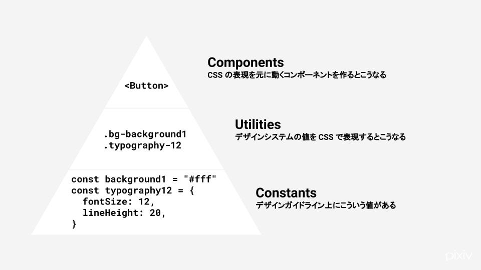
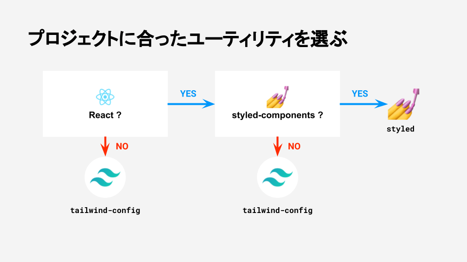

# charcoal について

charcoal はピクシブ株式会社のデザインシステムです。ここでは特に、Web フロントエンドの実装に用いる npm パッケージ集のことを言います。

## charcoal という名前

「charcoal（木炭）」とはデッサンの道具であり、線を引く、表現の基礎となる素材の一つです。また創作物を主役とするサービスの基盤として、それ自体は色を持たないモノクロの素材である、というニュアンスも含みます。

## 設計思想

charcoal はいわゆるコンポーネント実装も含みますが、それ以外にも UI の実装に必要なパッケージを多数収録しています。charcoal の設計思想は「定数」「ユーティリティ」「コンポーネント」の三層構造として説明されます。

- 定数（constants）: デザインシステム上にどういう色やスペーシングのルールがあるかを表す。デザイントークン。
- ユーティリティ（utilities）: 定数の値を CSS の表現に落とし込み、マークアップに使えるようにしたもの。
- コンポーネント（components）: 見た目と挙動が一体になった、それ単体で利用可能な UI の部品。

## charcoal のはじめ方

charcoal を導入する場合、最初にまず自分たちの技術スタックに適した「ユーティリティ」を選択します。

以下のフローチャートに従って、`tailwind-config` か `styled` を選択してください。

- **Q. React を使用しているか？**
  - No → [tailwind-config](pages/utilities/tailwind-config.md) を使用する
  - Yes → **Q. styled-components を使用しているか？**
    - No → [tailwind-config](pages/utilities/tailwind-config.md) を使用する
    - Yes → [styled](pages/utilities/styled.md) を使用する
