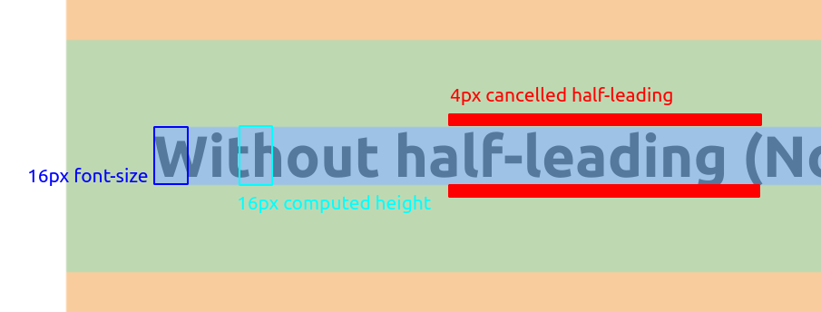
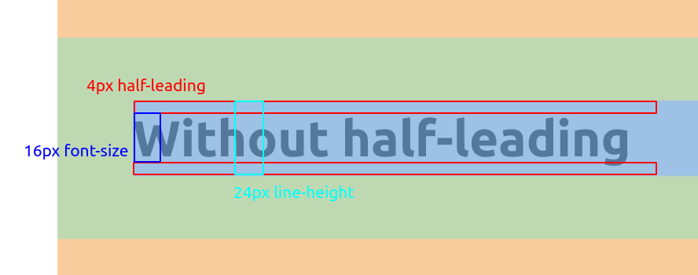

# `@charcoal-ui/styled`

charcoal のテーマの制約を利用可能にする styled-components のためのユーティリティです。

## インストール

npm

```bash
npm i @charcoal-ui/styled
```

yarn

```bash
yarn add @charcoal-ui/styled
```

## 使い方

`ThemeProvider`, `TokenInjector` を利用してテーマの定義を入れます。

```tsx
import { DefaultTheme, ThemeProvider } from 'styled-components'
import { light, dark, CharcoalTheme } from '@charcoal-ui/theme'
import { TokenInjector } from '@charcoal-ui/styled'

declare module 'styled-components' {
  export interface DefaultTheme extends CharcoalTheme {}
}

export default () => (
  <ThemeProvider theme={light}>
    <MyApp />
    <TokenInjector theme={{ ':root': light }} />
  </ThemeProvider>
)
```

こんな感じでコンポーネントを定義します。

```tsx
import styled from 'styled-components'
import { createTheme } from '@charcoal-ui/styled'
const theme = createTheme(styled)

const MyComponent = styled.div`
  display: flex;
  justify-content: center;

  ${theme((o) => [
    o.bg.surface2, // 背景色を変える
    o.font.text2, // 文字色を変える
    o.typography(20).bold, // フォントサイズを 20px にして太字にする
    o.padding.all(40), // padding を全方向に 40px
    o.margin.vertical(24), // margin を top と bottom だけ 24px
  ])}
`

export default () => <MyComponent>I am a big bold typography</MyComponent>
```

色や文字色など、テーマで定義できる値については `theme(o => )` で提供されます。

それ以外のプロパティはふつうに CSS で書きます（ `o.flex` のようなものは生えません ）。

## 条件つき theme

```tsx
const MyComponent = styled.div<{ big?: boolean }>`
  display: flex;
  justify-content: center;

  ${(props) =>
    theme((o) => [
      o.bg.surface2,
      o.font.text2,

      // 条件でユーティリティを分岐する
      props.big ? o.typography(20).bold : o.typography(14).bold,
    ])}
`

export default () => <MyComponent big={false}>I am not big</MyComponent>
```

## テーマのカスタマイズ

styled-components の`DefaultTheme`を拡張することでテーマのカスタマイズを行うことができます。

```tsx
import { DefaultTheme, ThemeProvider } from 'styled-components'
import { light, dark, CharcoalTheme } from '@charcoal-ui/theme'
import { Material } from '@charcoal-ui/foundation'

type MyTheme = CharcoalTheme & {
  color: {
    mycolor: Material
  }
}

declare module 'styled-components' {
  export interface DefaultTheme extends MyTheme {}
}

const myTheme = (theme: CharcoalTheme): MyTheme => ({
  ...theme,
  color: {
    ...theme.color,
    mycolor: '#ff9e8c',
  },
})

export default () => {
  const customizedTheme = myTheme(light)

  return (
    <ThemeProvider theme={customizedTheme}>
      <StyledText>I am text with mycolor</StyledText>
      <TokenInjector theme={{ ':root': customizedTheme }} />
    </ThemeProvider>
  )
}

const StyledText = styled.h1`
  ${theme((o) => [o.font.mycolor])}
`
```

## API

- `bg`

  - `bg.[色名]`

    背景色をつける

    - `bg.[色名].[...エフェクト]`

      背景色をつけて、+ホバーなどのエフェクトをつける。エフェクトは複数指定可能

      例：背景色 surface3 + ホバー時&押下時エフェクト

      ```jsx
      o.bg.surface3.hover.press
      ```

  - `bg.[グラデーション色名](方向)`

    グラデーション背景色をつける

    - `bg.[グラデーション色名](方向).[...エフェクト]`

      グラデーション背景色をつけて、+ホバーなどのエフェクトをつける。

      **⚠ 以下の条件のときのみ適用されます**

      - typography を指定しない
      - typography を指定する & preserveHalfLading を指定する
      - typography を指定する & padding を指定する

- `font`

  - `font.[色名]`

    テキスト色をつける

    - `font.[色名].[...エフェクト]`

      テキスト色をつけて、+ホバーなどのエフェクトをつける

- `typography(number)`

  フォントサイズを設定

  ガイドラインよりフォントサイズを指定すると自動的に行の高さも設定される

  **注意: デフォルトでハーフリーディングを削る処理が入っている**

  ハーフリーディングを削る処理

  

  本来の処理 (preserveHalfLeading 指定時)

  

  - `typography(number).[...(bold|monospace|preserveHalfLeading)]`

    太字・等幅など(複数指定可能)

    - `typography(number).preserveHalfLeading`

      デフォルトのハーフリーディングを削る処理を無効化する

- `margin(number)`

  マージンを設定(デフォルトで全方向)

  - `margin(number).[...(top|right|bottom|left|vertical|horizontal|)]`

    マージンを特定の方向のみに設定する(複数指定可能)

    📌 **引数に指定したい数値が入らない！**

    ガイドラインで定められている数値以外は型で弾くようにしています。
    文字の上下にある要素は half-leading が関わってくるので注意が必要です。figma では half-leading を考慮した値が表示されますが、ガイドラインでは **実際の余白(actual-spacing)** について定義されているという点を意識する必要があります。

- `padding(number)`

  パディングを設定(デフォルトで全方向)

  - `padding(number).[...(top|right|bottom|left|vertical|horizontal|)]`

    パディングを特定の方向のみに設定する(複数指定可能)

- `width`

  - `width.px(number|auto|full)`

    固定幅を設定

    ガイドラインに定数のみ設定可能

    - auto: `auto`が付与

    - full: `100%`が付与

  - `width.column(number)`

    グリッドシステムを利用した固定幅を設定

    デフォルトの場合はカラムサイズ 80px、ガーターサイズ 24px に設定されているため以下の計算式になる

    `px = column * 80 + (column - 1) * 24`

- `height`

  - `height.px(number)`

  - `height.column(number)`

- `border`

  ボーダーをつける

  デフォルトで全方向につく

  - `border.[名前].[...(top|right|bottom|left)]`

    ボーダーをつける方向を指定(複数指定可能)

    - 名前: いまは`default`しかない

- `borderRadius(number|'oval')`

  角丸をつける

  全方向につく(他は選べない)

  - ❓`oval`とは

    トラック状を作る場合に使う。角丸半径が短辺の 1/2 になる。

- `outline.[名前].[...(focus)]`

  - 名前:

    - `default`

      - フォーカス時などで使われる青色のアウトライン

    - `assertive`

      - エラー用の赤色のアウトライン

  - `focus`

    - **フォーカスした時だけ**、当該のフォーカスリングが出るようにする

- `disabled`

  - :disabled, [aria-disabled] のときに利用不可能な状態を表すスタイルを適用する
